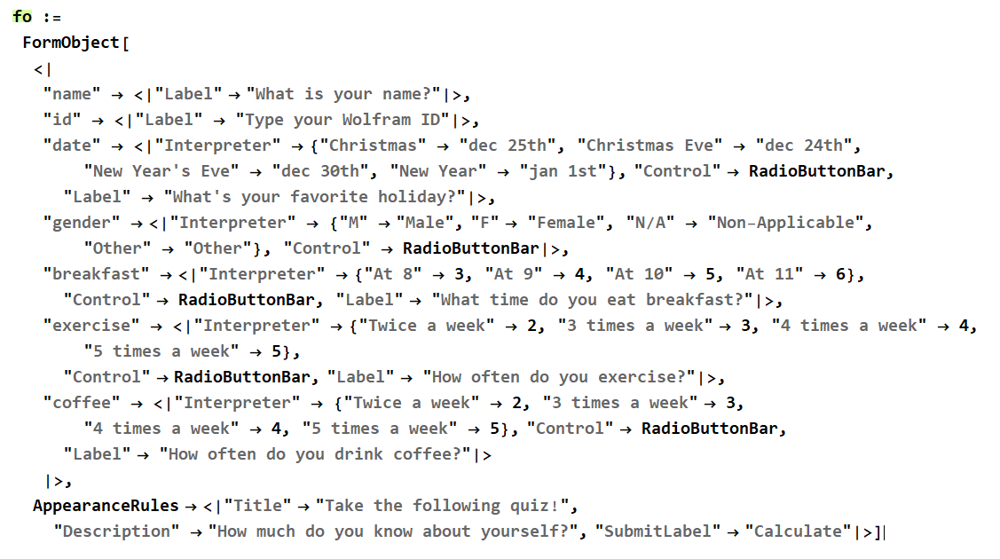
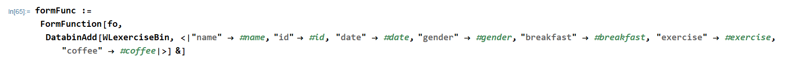

# Code_Challenge

I was given a set of 4 problems to solve for a junior developer position at Wolfram U and I'd like to demonstrate how I approached to solve them using Wolfram Language and other technologies.

## 4 Problems

> Create 5 single answer multiple choice questions, each with 4 unique choices. Use RadioButton, Checkbox, or similar control functions along with Style, Column or Grid.

> For each question add a Button labeled "Submit" that when clicked will add the user data to a public Databin. Use an Association for the data with keys "question" (Integer), "choice" (Integer), "date" (DateObject), and "id" (String) for the data. Add the current date and time along with that user's $WolframID to the Association.

> Deploy a form on the web that takes a $WolframID as input and returns a Dataset of that user data from the Databin\* used above.

> Deploy a form on the web that takes a question number (Integer) as input and returns a BarChart of all the answers to that question from the Databin\* used above.

My first impression when I saw these prompts was.. `"Man I had no idea I can do web development using Wolfram Language!"` And the next thought that came to my mind was.. `"I'm not sure if I can do this.."` Feeling devastated, I started by looking up Wolfram Language (WL from here on) [documentation]("https://reference.wolfram.com/language/") to find out how to use the features mentioned in the instructions.

Aside from the fact that I'm not really familiar with the features, I knew that I need to make some sort of a form to collect/save data in a database, and another form to query the database and return a visualization of the queried result. So I get the gist of the prompt but the problem as you may already know is.. **How do I do it?**

At that moment, I decided to remember what I've learned over the past several months while I was studying to become a developer and then move forward:

`A good developer is not someone who knows every minute detail about the language syntax and knows how to code everything from scratch, but is someone who knows where to look for help and resources.`

## Form Object

I scraped pieces of information from the WL documentation center and other resources such `Wolfram StackExchange` and `Wolfram Community` and here's what I've learned so far:

- The web form in WL is made up of [Form Objects](https://reference.wolfram.com/language/ref/FormObject.html) and it constitutes each row of the form
- They layout of the form is defined by the [FormLayoutFunction[]](https://reference.wolfram.com/language/ref/FormLayoutFunction.html) (e.g., title, description, and etc.)

And here is how I defined the `Form Object`:

Wolfram Language has quite a few symbols that can replace words and I learned that [Association](https://reference.wolfram.com/language/ref/Association.html) can be replaced by `<||>`. I feel like it's a similar concept to `Arrow Function` in JavaScript which makes codes look more concise. Also, here I used `delayed evaluation (:=)` or [RuleDelayed](https://reference.wolfram.com/language/ref/RuleDelayed.html) to be exact. I learned that this tells the program that the values for the form will be entered by the user later. Also, because of it this line of code will not have an output.

- Each object has its own association and it contains a few options inside:
  - [Interpreter](https://reference.wolfram.com/language/ref/Interpreter.html): For the object to use a control function like `RadioButtonBar` and understand the input, `Interpreter` was used to create 4 unique choices and each choice was interpreted accordingly.
  - [RadioButtonBar](https://reference.wolfram.com/language/ref/RadioButtonBar.html): As mentioned above, the multiple choice question format was created by using `RadioButtonBar`.
  - [Label](https://reference.wolfram.com/language/ref/Label.html): `Label` was used as a question attached to each object to ask the user to choose one option among the choices.
  - [AppearanceRules](https://reference.wolfram.com/language/ref/AppearanceRules.html): This part gives the form a title, description, and a label for the submit button.

## Databin to store data

Here, a databin was created by using the [CreateDatabin[]](https://reference.wolfram.com/language/ref/CreateDatabin.html) function and it is stored in the Wofram Data Drop. In Data Drop, all the data the users enter will be stored.

- `Name`: The name of the `Databin` is **WL Exercise**
- `Permissions`: This is set to public so anyone with the ID of this databin can access the data inside it.
- The list of data with its data types is defined here as well.

## FormFunction[]

For the form to receive the values from the users, [FormFunciton[]](https://reference.wolfram.com/language/ref/FormFunction.html) was used here. Inside the function:

- The first argument, `fo`, is the `Form Object` which was defined in the first step.
- The second argument, [DatabinAdd[]](https://reference.wolfram.com/language/ref/DatabinAdd.html) defines the data that will be added to `WL Exercise` which was defined in the second step.
- Each variable defined in `Form Object` is associated with `#variable_name` and it tells the program that the code is referring to the same variable in the program.
- The entire function is defined into `formFunc` with delayed evaluation like how `fo` was defined.

## CloudDeploy[]

[CloudDeploy](https://reference.wolfram.com/language/ref/CloudDeploy.html) was used to deploy the program to the cloud. The `Permissions` was set to `"Public"` so anyone can access this web form with the url.

## Results

- Web Form:
  

- Databin in DataDrop:
  

## Next Steps

So the next problem I had to solve was this: `Deploy a form on the web that takes a $WolframID as input and returns a Dataset of that user data from the Databin above`. I looked into the documentation center, Wolfram Community, StackExchange, and other resources to find out how to perform this task using WL but I wasn't able to do so. If I was a freelancing developer working for a client and encountered this sort of situation, this is when I would have asked him/her to have a chat about the difficulty I'm having and maybe offered him/her an alternative way to go about this.

Since in this case I had no one to consult with about this matter, I decided to go ahead and choose a different technology that I could find a resource for and resolve the issue. After many hours of researching, I learned how to create a web form that submits data into MS SQL Server and then fetches/displays it in grid-view using **ASP.NET, C#, and MS SQL Server Management Studio**. It took awhile to learn how to set up/connect to a server and write a C# code to manipulate the html file to submit the entered data to my database. Howerver, I was able to finish writing up everything (see the codes in [Default.aspx](https://github.com/wonhee3472/Code_Challenge/blob/main/Default.aspx) and [Default.aspx.cs](https://github.com/wonhee3472/Code_Challenge/blob/main/Default.aspx.cs)). Now I have a web form working and it looks like this in the front-end:

And I entered 5 different data myself using the form and now we can see that the database has those 5 different entries:

Now that the database has been established with the data, I have to create another web form to `take a WolframID as input` and `return a dataset of that user data` from the database. This was also done with **ASP.NET, C#, and MS SQL Server** and the code for this task can be found in [Search.aspx](https://github.com/wonhee3472/Code_Challenge/blob/main/Search.aspx) and [Search.aspx.cs](https://github.com/wonhee3472/Code_Challenge/blob/main/Search.aspx.cs).

- This is the result I get if I enter the `Wolfram ID` existing in the database:
  

- In contrast, I get an error message that says **Record Not Found** if I enter an invalid user data:
  

## Last Problem

The prompt for the last problem is this: `Deploy a form on the web that takes a question number as input and returns a BarChart of all the answers to that question from the database.`

I understood this as more like a prompt that asks for an interactive dashboard. That is, a user would either **type in** or **choose** a question number to see a visualized response (in this case, a bar chart) to the selected question. Since I haven't figured out how to do this using WL, I decided to create a simple dynamic Plotly Chart using **HTML and JavaScript**.

First, I set up a [index.html](https://github.com/wonhee3472/Code_Challenge/blob/main/index.html) page with the appropriate links to the `plotly` library and a JavaScript file `index.js`. The page contains a dropdown menu with a `id` of `dropdownMenu`:

I hard coded the [index.js](https://github.com/wonhee3472/Code_Challenge/blob/main/index.js) file with the data I'd like to visualize on the web page and this is something I wish I avoided. Instead, I wanted to export the data from the database in a `json` format and use `d3.json` to load and retrieve the data file. Then I would have created a function that builds a chart according to the option chosen in the dropdown menu. Unfortunately, I wasn't able to figure out how to programmatically collect the number of `city` and `gender` selected in each response so I put the data in `index.js` by hand. This was only possible since the dataset was made up of only 5 entries but it would not be possible if I had to deal with a much larger dataset. However, since I would like to demonstrate my ability to create a responsive form, I went ahead and included the data in the file:

The result of this code put together is as below:

## Reflection

This challenge was really fun actually because I got to tinker with a few technologies I never learned. I don't think I can say to myself confidently that I've become an expert at the languages I've learned over the past few days but I can definitely say I've learned something pretty cool and I want to keep learning technologies like these!

Also, I realized how powerful and efficient WL is. Take the third challenge as an example -- I had to set up a server/database with MS SQL server management studio, code in C# to make a form on the web (a local host more likely), and write a SQL query to insert the results to the database. However, I would've completed all these tasks only with WL if I figured out how to do them. Meaning, I wouldn't have had to go back and forth between languages and platforms to do all of that. Also, the form would've been readily available for anyone with the cloud technology embedded in WL unlike the form I created with the other techs. That said.. I hope to be given a chance to learn how to program in WL so I could do tasks like this more efficiently and effectively.
